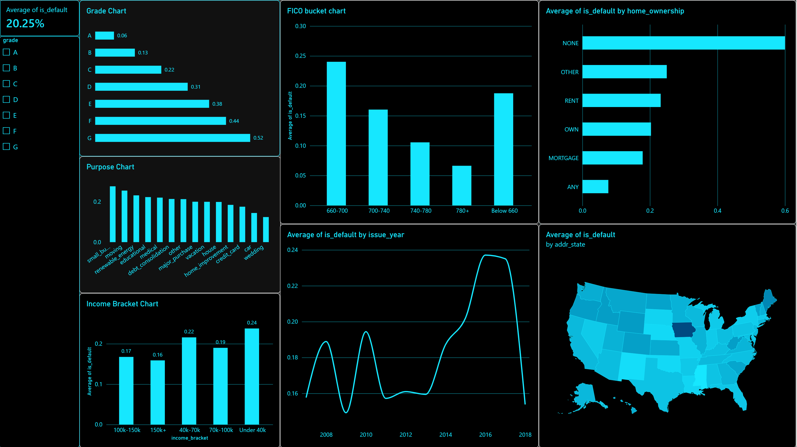

# Loan Default Risk Analysis

An end-to-end data analysis project examining what drives loan default risk, using Lending Club's public accepted-loans dataset (2007–2018Q4).

## Tools
**Python (pandas)** → data cleaning and preprocessing
**SQL (SQLite)** → risk segmentation and exploratory analysis
**Power BI** → interactive dashboard

## Pipeline

1. **Data cleaning (`LoanData.ipynb`)** — Loaded the full 2.26M-row Lending Club accepted-loans dataset, sampled 100,000 rows for a manageable working set, filtered to loans with a resolved outcome (Fully Paid or Charged Off), engineered a binary `is_default` target, handled missing values, fixed data types, and exported a clean 59,585-row dataset (`loan_data_cleaned.csv`) into a SQLite database (`loan_data.db`).

2. **Risk segmentation (`queries.sql`)** — Queried the cleaned data to find default rate by loan grade, purpose, income bracket, employment length, and FICO score band.

3. **Dashboard (Power BI)** — Built an interactive dashboard visualizing default rate by grade, purpose, FICO bucket, income bracket, home ownership, issue year, and US state, with a grade slicer for filtering.

## Key findings

Default risk in this dataset is driven primarily by **loan grade** and **FICO score** — default rates range from ~6% for Grade A borrowers up to over 50% for Grade G, and follow a similarly steep decline from ~24% (FICO 660–700) down to ~7% (FICO 780+). **Loan purpose** matters too: small business and moving loans default at nearly 2x the rate of loans backed by higher income or better credit history. One less obvious finding — borrowers with **missing employment length data** default at a higher rate (27.4%) than any single stated employment bracket, suggesting incomplete applications carry their own risk signal worth flagging in an underwriting process. Default rates also spiked noticeably in loans issued 2016–2018, consistent with rapid growth in the platform's loan volume during that period.

*(Note: a few segments — like the "Below 660" FICO bucket and "NONE" home ownership category — have very small sample sizes and their default rates should be read with caution rather than treated as reliable trends.)*

## Files
- `LoanData.ipynb` — data cleaning notebook
- `queries.sql` — SQL risk segmentation queries
- `loan_data_cleaned.csv` — cleaned dataset (59,585 rows)
- `dashboard_screenshot.png` — Power BI dashboard preview

